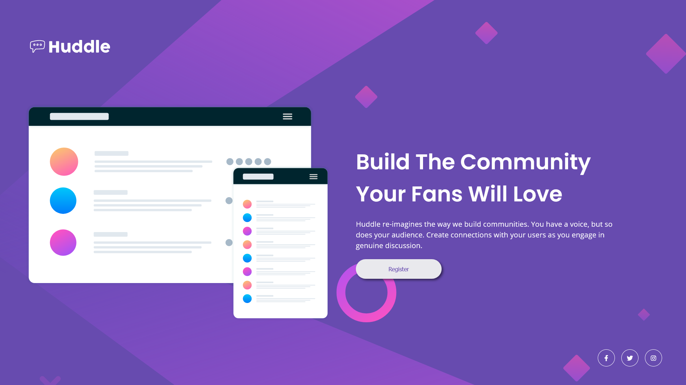

# Frontend Mentor - Huddle landing page with single introductory section solution

This is a solution to the [Huddle landing page with single introductory section challenge on Frontend Mentor](https://www.frontendmentor.io/challenges/huddle-landing-page-with-a-single-introductory-section-B_2Wvxgi0).

## Table of contents

- [Overview](#overview)
  - [The challenge](#the-challenge)
  - [Screenshot](#screenshot)
  - [Links](#links)
- [My process](#my-process)
  - [Built with](#built-with)
  - [What I learned](#what-i-learned)
  - [Continued development](#continued-development)
  - [Useful resources](#useful-resources)
- [Author](#author)

## Overview

### The challenge

Users should be able to:

- View the optimal layout for the page depending on their device's screen size
- See hover states for all interactive elements on the page

### Links

- Solution URL: [GitHub Repository](https://github.com/kutu-dev/huddle-page-introductory-section)
- Live Site URL: [GitHub Pages](https://kutu-dev.github.io/huddle-page-introductory-section/)

### Screenshot

#### Desktop

##### Hover

##### Focus

#### Mobile

##### Hover

##### Focus

## My process

### Built with
- Semantic HTML5 markup
- CSS custom properties
- Flexbox
- Mobile-first workflow
- External JavaScript

### What I learned

How to structure more complex websites.

### Continued development

Do more planning before start making the website.

### Useful resources

- [ Mozilla Developer Network ](https://developer.mozilla.org/es/)

## Author

Created with :heart: by [Kutu](https://kutu-dev.github.io/).

> - GitHub - [kutu-dev](https://github.com/kutu-dev)
> - Twitter - [@kutu_dev](https://twitter.com/kutu_dev)
> - Frontend Mentor - [@kutu-dev](https://www.frontendmentor.io/profile/kutu-dev)
